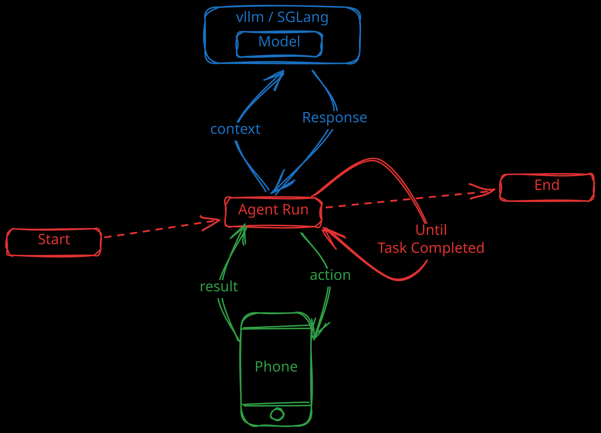

# Deep Dive into Open-AutoGLM Workflow

This article analyzes the recently popular open-source project [Open-AutoGLM](https://github.com/zai-org/Open-AutoGLM) from a source code perspective.

<!-- more -->

## Overview of Open-AutoGLM

> Open-AutoGLM is a mobile intelligent assistant framework built on AutoGLM. 
>
> It understands phone screen content in a multimodal manner and helps users complete tasks through automated operations. 
>
> The system controls devices via ADB (Android Debug Bridge), perceives screens using vision-language models, 
> and generates and executes operation workflows through intelligent planning. 
>
> Users simply describe their needs in natural language, such as "Open eBay and search for wireless earphones." and Open-AutoGLM will automatically parse the intent,
> understand the current interface, plan the next action, and complete the entire workflow. 
>
> The system also includes a sensitive operation confirmation mechanism and supports manual takeover during login or verification code scenarios. 
>
> Additionally, it provides remote ADB debugging capabilities, allowing device connection via WI-FI or network for flexible remote control and development.

## Agent Run



After deploying the model and install the dependencies following the `README.md`, we can run the scripts to execute our task:

> python main.py --lang en --base-url http://localhost:8000/v1 "Open Chrome browser"

After the script is executed, it will first instantiate the corresponding agent based on the parameters, supporting "HarmonyOS", "iOS", and "Android".

Then call the `agent.run` method to start the agent execution.

```python title="main.py" hl_lines="5"
...

if args.task:
    print(f"\nTask: {args.task}\n")
    result = agent.run(args.task)
    print(f"\nResult: {result}")
else:
    ...
```

In `run` method, it will loop through calling `agent._execute_step` within the limited number of steps until the agent returns that the task is completed.

```python title="phone_agent/agent.py" hl_lines="15" 
def run(self, task: str) -> str:
    """
    Run the agent to complete a task.

    Args:
        task: Natural language description of the task.

    Returns:
        Final message from the agent.
    """
    self._context = []
    self._step_count = 0

    # First step with user prompt
    result = self._execute_step(task, is_first=True)

    if result.finished:
        return result.message or "Task completed"

    # Continue until finished or max steps reached
    while self._step_count < self.agent_config.max_steps:
        result = self._execute_step(is_first=False)

        if result.finished:
            return result.message or "Task completed"

    return "Max steps reached"
```

### Execute Step

In `_execute_step` method, if it is the first step (the first called in `run`), 
it will add the system prompt and use prompt (In this case, it is `Open Chrome browser`) to the context:

```python title="phone_agent/config/prompts_en.py"
SYSTEM_PROMPT = (
    "The current date: "
    + formatted_date
    + """
# Setup
You are a professional Android operation agent assistant that can fulfill the user's high-level instructions. Given a screenshot of the Android interface at each step, you first analyze the situation, then plan the best course of action using Python-style pseudo-code.

# More details about the code
Your response format must be structured as follows:

Think first: Use <think>...</think> to analyze the current screen, identify key elements, and determine the most efficient action.
Provide the action: Use <answer>...</answer> to return a single line of pseudo-code representing the operation.

Your output should STRICTLY follow the format:
<think>
[Your thought]
</think>
<answer>
[Your operation code]
</answer>

...
"""
)
```

In each execution, the current application name and a screenshot of the page are added to the context:

```python title="phone_agent/agent.py" hl_lines="16-20 25-29"
...
# Capture current screen state
device_factory = get_device_factory()
screenshot = device_factory.get_screenshot(self.agent_config.device_id)
current_app = device_factory.get_current_app(self.agent_config.device_id)

# Build messages
if is_first:
    self._context.append(
        MessageBuilder.create_system_message(self.agent_config.system_prompt)
    )

    screen_info = MessageBuilder.build_screen_info(current_app)
    text_content = f"{user_prompt}\n\n{screen_info}"

    self._context.append(
        MessageBuilder.create_user_message(
            text=text_content, image_base64=screenshot.base64_data
        )
    )
else:
    screen_info = MessageBuilder.build_screen_info(current_app)
    text_content = f"** Screen Info **\n\n{screen_info}"

    self._context.append(
        MessageBuilder.create_user_message(
            text=text_content, image_base64=screenshot.base64_data
        )
    )
...
```

#### Request Model & Parse Response

After preparing the context, it will call the `self.model_client.request(self._context)` method to send the request to the model server,
`model_client` is `openai.OpenAI` instance in this case:

```python title="phone_agent/agent.py" hl_lines="7"
# Get model response
try:
    msgs = get_messages(self.agent_config.lang)
    print("\n" + "=" * 50)
    print(f"💭 {msgs['thinking']}:")
    print("-" * 50)
    response = self.model_client.request(self._context)
except Exception as e:
    if self.agent_config.verbose:
        traceback.print_exc()
    return StepResult(
        success=False,
        finished=True,
        action=None,
        thinking="",
        message=f"Model error: {e}",
    )
```

After getting the response from the model, it will parse the response to get the thought and action code:

```python title="phone_agent/agent.py" hl_lines="3"
# Parse action from response
try:
    action = parse_action(response.action)
except ValueError:
    if self.agent_config.verbose:
        traceback.print_exc()
    action = finish(message=response.action)
```

In the `parse_action` function, it will extract the required `action` or `task completed` from the model's response, 
which is constrained by the **system prompt**, and return it. 
If parsing fails, the outer method will still consider the `task completed`.

```python title="phone_agent/actions/handler.py"
def parse_action(response: str) -> dict[str, Any]:
    """
    Parse action from model response.

    Args:
        response: Raw response string from the model.

    Returns:
        Parsed action dictionary.

    Raises:
        ValueError: If the response cannot be parsed.
    """
    ...
```

#### Execute Action

After getting the action, it will call the `ActionHandler.execute` method to execute the action. 

`task finished` is also a kind of action, it will return result with attributes `should_finish=True`:

```python title="phone_agent/actions/handler.py" hl_lines="7-15"
def execute(
    self, action: dict[str, Any], screen_width: int, screen_height: int
) -> ActionResult:
    """
    Execute an action from the AI model.

    Args:
        action: The action dictionary from the model.
        screen_width: Current screen width in pixels.
        screen_height: Current screen height in pixels.

    Returns:
        ActionResult indicating success and whether to finish.
    """
    ...
```

After executing the action, the **base64** string of the image will be removed 
and the model response and execution result will be appended to the context for the next step.

#### Step Result

Finally, the `_execute_step` method will return the `StepResult` instance to indicate 
whether the step is successful and whether the task is finished.

```python title="phone_agent/agent.py" hl_lines="5-11"
def _execute_step(
        self, user_prompt: str | None = None, is_first: bool = False
    ) -> StepResult:
    ...
    return StepResult(
        success=result.success,
        finished=finished,
        action=action,
        thinking=response.thinking,
        message=result.message or action.get("message"),
    )
```

The outermost function `agent.run` will determine whether to end directly or let the model continue the task based on the result.
